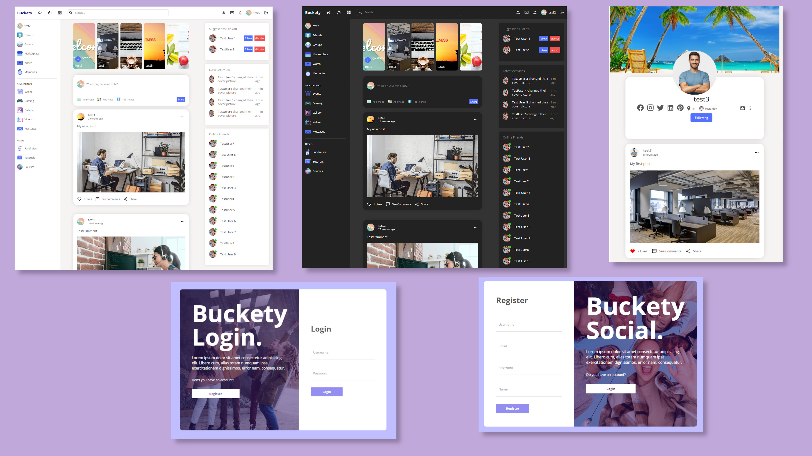

# React-Social-v1

Minimal social media web app which can allow users to login and post pictures with the ability to follow friends! Bonus Dark Mode toggle available.

### Tech Stack

**FrontEnd**

- ReactJS Lib
- React ContextAPI for state management
- SCSS for styling

**BackEnd**

- NodeJS - Express
- MySQL
- JWT auth

## Design

## FlowGif

Click to play gif

## For Dev

- Clone this repo `git clone https://github.com/pvishnuprasaath/react-social-v1.git` (contains both client and api)
- For Client

  - `npm install` to get all the dependencies
  - CORS enabled for client running at localhost:3000. Modify if needed
  - Complete the below server setup and finally run `npm start`

- For Server

  - `npm install` to get all the dependencies
  - Install MySQL workbench and create a schema named 'social'.
  - [/assets/social_db.sql](https://github.com/pvishnuprasaath/react-social-v1/blob/master/assets/social_db.sql) is uploaded for easy schema import
  - Express is configured to run at localhost:8800. Client makes axios request here. Modify both client and server port if needed
  - provide mysql connection credentials in api/connect.js
  - `npm run start` will spin up the server
